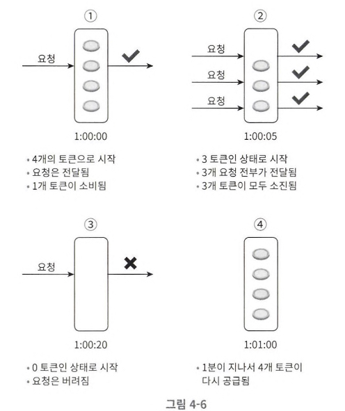
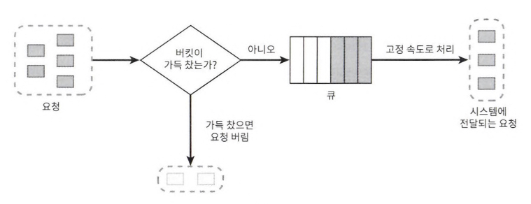
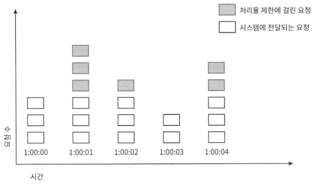
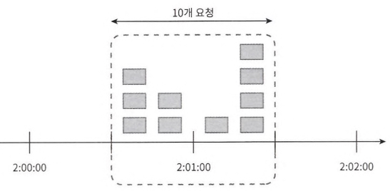
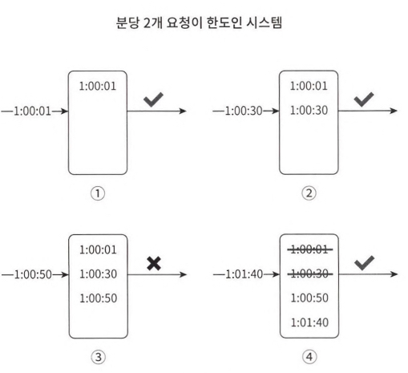
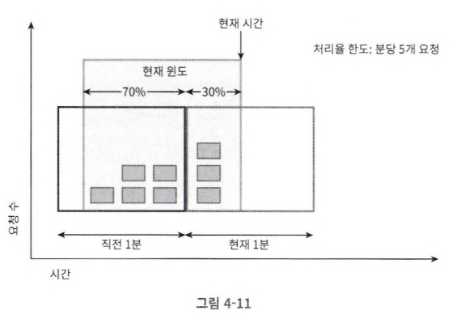
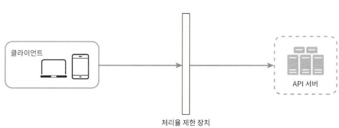
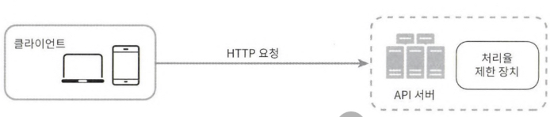
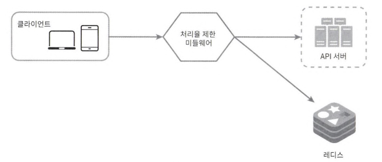
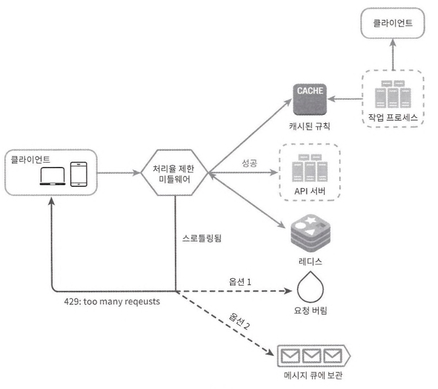

# [대규모 시스템 설계 기초] 4. 처리율 제한 장치의 설계

# 1. 문제 이해 및 설계 범위 확정

## rate limit

- 특정 기간 동안 허락하는 요청의 수

## rate limiter

- 정해진 임계치를 넘어서면 추가로 도달한 호출은 처리가 중단되도록 하는 제어장치
- 장점
  - DoS 공격에 의한 자원 고갈 방지
  - 비용 절감
  - 과부하 방지

## decision factor

- type
  - consumer-side rate limiter
  - provider-side rate limiter
- throttling rule
  - IP
  - User ID
- system scale
  - start-up
  - enterprise (distributed)
- exception handling (alarming)
- deployment strategy
  - application code
  - independent service

## algorithm

- 얼마나 많은 요청이 접수되었는지를 추적할 수 있는 카운터를 추적 대상별로 둠
- 한도를 넘어 도착한 요청은 거부

### token bucket

- refiller: 컨테이너에 설정된 양(refill rate)의 토큰을 분당 주기적으로 채움
- overflow: 버킷이 가득 차면 토큰은 버려짐
- use: 각 요청은 처리될 때마다 하나의 토큰을 사용
- dropped: 토큰이 부족할 경우, 요청은 버려짐
- bucket 공급 제한 규칙: API endpoint, IP, request

---

- 장점: 메모리 효율적. 짧은 시간에 집중되는 트래픽 처리 가능
- 단점: bucket size, refill rate 두 개의 인자를 적절히 튜닝하는 것이 까다로움

### leaky bucket

- token bucket과 비슷. rate limit가 고정되어 있음(FIFO Queue)

---

- 장점: 메모리 효율적. 고정된 출력율을 가짐
- 단점: 단시간에 많은 트래픽이 몰릴 경우 오래된 요청이 쌓여서, 최신 요청들이 버려질 수 있음

### fixed window counter

- window
  - 타임라인을 고정된 간격으로 나눈 단위
  - 각 window에는 counter가 붙음
    - 요청이 접수될 때마다 1씩 증가
    - 임계치에 도달 시, 새로운 요청은 새 윈도가 열릴 때까지 버려짐

---

- 장점
  - 메모리 효율 좋음
  - 윈도가 닫히는 시점에 카운터를 초기화하는 방식은 특정한 트래픽 패턴을 처리하는데 적합
- 단점

  

  - burst of traffic: 윈도 경계 부근에 일시적으로 많은 트래픽이 몰려들 경우, 처리 한도보다 많은 양의 요청을 처리

### sliding window log (fixed sliding window의 단점을 보완한 알고리즘)

- timestamp 기록
  - 보통 redis의 sorted set 자료구조에 보관함
- 윈도우 유지
  - 주어진 window 동안의 요청만 로그에 유지함
- 요청 수 계산 + 요청 허용 여부 결정

---

- 장점: 어느 순간의 윈도를 보더라도 허용되는 요청의 개수는 시스템의 처리율 한도를 넘지 않음
- 단점: 다량의 메모리 사용 (timestamp 저장)

### sliding window counter (fixed sliding window + sliding window log)

- 주어진 시간 동안 특정 작업이 얼마나 자주 수행되는지 추적하고 제한하기 위해 사용됨
- window를 여러 작은 bucket으로 나누어 각 간격 내에서 요청 수를 세는 방식으로 동작

- bucket 생성
- 요청 카운트 증가: 각 요청이 들어올 때마다 해당 요청이 속한 버킷의 카운트를 증가시킴
- 오래된 버킷 제거
- 요청 수 합산: 현재 window 내의 모든 bucket의 요청 수를 합산하여 총 요청 수를 계산함
- 요청 허용 여부 결정

- 장점
  - 짧은 시간에 몰리는 트래픽에도 잘 대응함 (이전 시간대의 평균 처리율에 따라 현재 윈도의 상태를 계산)

# 2. 개략적 설계안 제시 및 동의 구하기

## 가정

- low latency
- lower memory asap
- distributed rate limiting
- exception handling: alarm
- high fault tolerance

## Step 1: type(where to install)

### consumer-side rate limiter

- 단점: 위변조에 취약

### middleware rate limiter

- MSA: API Gateway (fully managed)

### provider-side rate limiter

### decision factor

- tech stack(language, cache): 서버 측 구현을 지원하기 충분할 정도로 효율이 있는지
- rate limit algorithm: middleware일 경우 선택지가 제한될 수 있음 (provider-side일 경우 자유로움)

### rough architecture

- counter 보관: cache (redis.시간에 기반한 만료 정책 지원)
  - incr: counter값 +1
  - expire: counter에 timeout 값 설정

# 3. 상세 설계

## throttling rule

- configuration file
- 5 request per minute

## exceeding throughput limits rule

- response code: 429
- http header
  - X-Ratelimit-Remaining: window 내, 처리 가능한 남은 요청 수
  - X-Ratelimit-Limit: 매 window 마다 클라이언트가 전송할 수 잇는 요청 수
  - X-Ratelimit-Retry-After: 한도 제한에 걸리지 않으려면 몇 초 뒤에 요청을 다시 보내야 하는지 (초단위)

## Architecture

1. request to rate limit middleware
2. retrive throttling rule, counter, last timestamp from cache(redis)
  - check if rate limit has been reached

### distributed + scale out + parallel threads

- race condition(counter) ⇒
  - lock: 한 스레드가 특정 변수를 업데이트 하는 동안 다른 스레드는 접근 대기
  - lua script: redis 원자적 연산 수행
  - sorted set: timestamp 관리. 가장 최신 값을 빠르게 얻을 수 있음
- synchronization ⇒ sticky session, stateless web layer, centralized cache

### optimize performance

- 지역성을 고려한 여러 데이터센터
- 최종 일관성 모델

### monitoring
