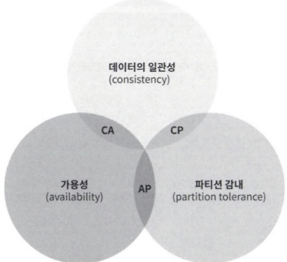
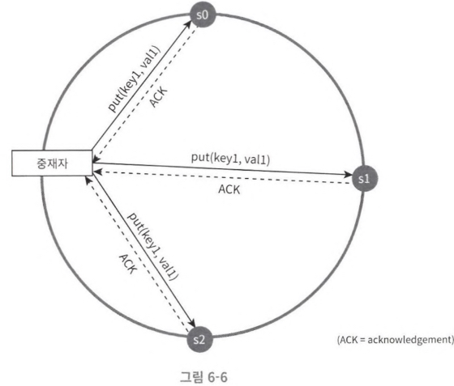
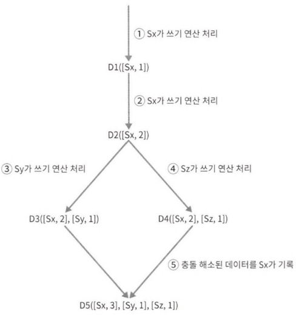
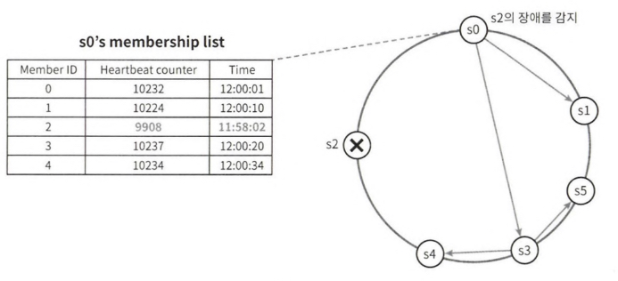
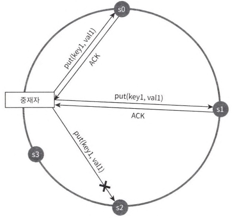
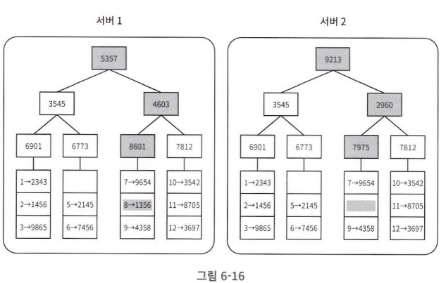
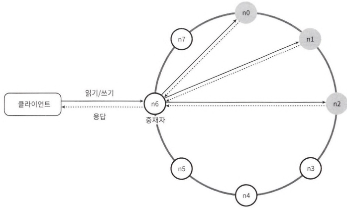
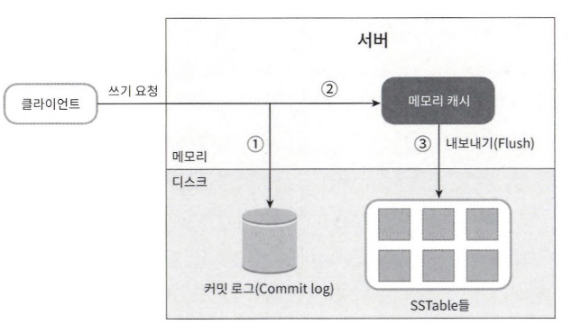
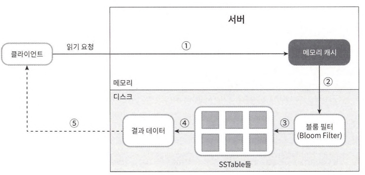

# 6. 키-값 저장소 설계
# non-relation database

- data(pair): key-value
  - key: text or hash (짧을수록 좋음)
  - value: any

# 설계

- 요소
  - 읽기, 쓰기, 메모리 사용량
  - 데이터 일관성, 데이터 가용성
- 타협적 결정 필요

## 요구사항

- 데이터: 10KB 이하. 대용량 데이터 저장 O
- 가용성: 높음
- 규모 확장성: 높음
- 데이터 일관성 수준: 조절 가능
- response latency: 짦음

## 해결: 단일 서버 키-값 저장소

- 메모리에 해시 테이블 형태로 저장
- 장점: 빠른 속도
- 단점: 모든 데이터를 메모리 안에 두는 것이 불가능할 경우 사용 불가 (→ 데이터 압축, 자주쓰는 데이터만 메모리에 올리기)

## 해결: 분산 키-값 저장소

- 데이터를 여러 db서버에 분산시키는 방식

### CAP 정리

- Consistency: 모든 클라이언트는 언제나 같은 데이터를 볼 수 있음 (어떤 노드의 접속과 상관 X)
- Availability: 모든 클라이언트는 항상 응답을 받을 수 있어야 함 (어떤 노드의 장애발생 상관 X)
- Partition Tolerance: 시스템의 일부 노드가 서로 통신할 수 없어도 시스템은 정상동작 해야 함

### 실세계

- 파티션 발생은 필연적으로 일어남 → 일관성, 가용성 중 하나를 택해야 함
- CP(Consistency, Partition Tolerance): 쓰기 연산 중단 O (HBase, MongoDB)
- AP(Availability, Partition Tolerance): 낡은 데이터 반환 가능성 O (Cassandra, Couchbase)

### 시스템 컴포넌트

- data partition
  - 데이터를 작은 파티션으로 분할 → 여러대의 서버에 저장
- data replication
  - 데이터를 N개 서버에 비동기적으로 복제
- data consistency
  - 
  - Protocol: Quorum Consensus(읽기/쓰기 모두 일관성 보장)
    - N: 사본 서버 수
    - R: 읽기 정족수(데이터 읽기를 위한 필요 노드 수)
    - W: 쓰기 정족수(데이터 쓰기를 위한 필요 노드 수)
  - model
    - strong consistency: 모든 읽기 연산은 가장 최근에 갱신된 결과를 반환
    - weak consistency: 읽기 연산은 가장 최근에 갱신된 결과를 반환 못할 수도 있음
      - eventual consistency: 갱신 결과가 결국 모든 사본에 동기화 (dynamo, cassandra)
- data inconsistency resolution: data versioning
  - 데이터를 변경할 때마다 해당 데이터의 새로운 버전 생성. (각 버전 데이터는 immutable)
  - vector clock
    - 충돌을 발견하고, 자동으로 해결해내기 위한 기술
      - 어떤 버전이 선행 버전인지, 후행 버전인지, 다른 버전과 충돌이 잇는지 판별하는데 쓰임
    - data format: [server, version]
      - 
      - D([S1, v1], [S2, v2])
      - [Si, vi]가 있으면 vi를 증가. 그렇지 않으면 새 항목 [Si, 1] 생성
  - 단점
    - 충돌 감지 및 해소 로직이 클라이언트 코드에 들어감
    - [서버: 버전] 순서쌍 개수가 굉장히 빨리 늘어남 ⇒ 임계치 설정
- data failure
  - detection: gossip protocol 
    - 방식
    
      - 각 노드가 membership list를 관리 (membership list: memberId - heartbeat counter)
      - 각 노드가 주기적으로 자신의 heartbeat counter를 증가시킴
    - 분산된 장애 감지
      - 어떤 멤버의 박동 카운터 값이 지정된 시간 동안 갱신되지 않으면 해당 멤버는 장애 상태로 간주
  - resolution (fallback)
    - 일시적: hinted handoff
      - 
      - 장애 상태의 서버의 일을 다른 서버가 처리. (대신 처리한 서버에 hint 표시)
      - 장애 서버가 복구되면 그동안 변경된 데이터를 일괄 반영
    - 영구적: anti-entropy protocol 
      - 사본들을 비교하여 최신 버전으로 동기화
      - 머클 트리(hash tree)
        -  
        - 사본 간 일관성 관리
        - 해시값(레이블): 각 노드의 해시값 그 자식 노드들의 해시 값 또는 레이블을 사용하여 계산
        - 각 서버의 대응되는 노드 값을 비교하여 갱신 여부 판단 -> 갱신된 부분만 동기화 가능 
- system architecture diagram
  - client-server: API
  - coordinator: client의 proxy 역할 (분산 환경에서 요청을 조정)
    - 
  - data: distributed across multiple nodes
  - node: consistent hash(hash ring) 위에 분포
    - decentralized. same responsibility (SPOF X)
    - 모든 기능 지원 (client API, failure detection, fallback, inconsistency resolution…)
- read path
  - 
  1. 쓰기 요청이 커밋 로그 파일에 기록됨
  2. 데이터가 메모리 캐시에 기록됨
  3. 메모리 캐시가 가득차면 SSTable에 기록됨
- write path
  - 
  1. 데이터가 메모리에 있는지 확인
  2. 데이터가 메모리에 없으므로 블룸 필터를 검사
  3. 블룸 필터를 통해 어떤 SSTable에 키가 보관되어 있는지 알아냄 → 데이터 가져옴
  4. 해당 데이터를 클라이언트에게 반환
