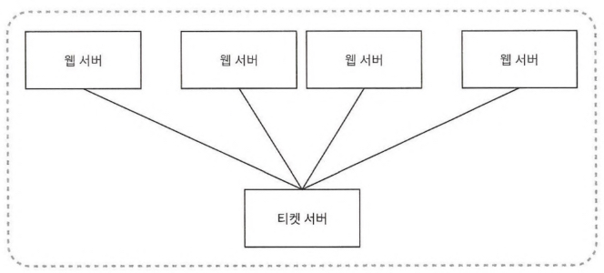
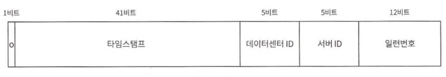

# 7. 분산 시스템을 위한 유일 ID 생성기 설계

생성일: 2024년 6월 21일 오후 8:44
생성시간: 2021년 9월 29일 오후 2:11 (GMT+9) → 오후 2:42
출처: 책
구분: 요약
상태: 진행중

relational database: auto_increment

# 문제

## 요구사항: ID 성질

- 분산환경
- 유일성
- 숫자. 64비트 내
- 시스템 규모: 초당 10000개 생성
- 정렬 가능

# 해답

## ID 생성 방식

### multi-master replication
- auto_increment
    - increment interval: k(number of database in use)
- 단점
    - 데이터 센터 단위의 규모 늘리기 어려움
    - 시간의 흐름에 맞추어 커지도록 보장할 수 없음
    - 서버 추가 or 삭제시, 정상 동작하도록 만들기 어려움

### UUID (Universally Unique Identifier)
- 컴퓨터 시스템에 저장되는 정보를 유일하게 식별하기 위한 128비트 짜리 수
- 장점
    - 구현 쉬움
    - 충돌가능성 낮음
- 단점
    - 값이 큼 (128비트)
    - 시간순으로 정렬 불가

### ticket server
- 
- auto_increment 기능을 가진 데이터베이스 서버를 중앙 집중형 티켓서버로 만들어 ID를 발행받음
- 장점
    - 구현 쉬움
- 단점
    - ticket server가 SPOF가 됨

### snowflake by twitter
- 생성할 ID의 구조를 여러 section으로 분할
- 구조
  - 
  - 0~1: sign bit
  - 1~41: timestamp (10진수 → twitter의 epoch 시간 더함 → 밀리초 값을 UTC 시간으로 변환)
  - 42~46: datacenter id
  - 47~51: server id
  - 52~63: serialized bit

# 시계 동기화
## NTP(Network Time Protocol)
- 각 서버가 같은 시계를 사용하지 않을 경우 동기화를 위한 프로토콜
