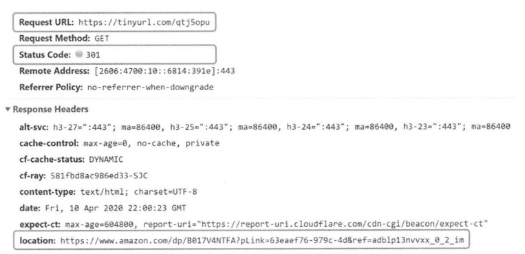
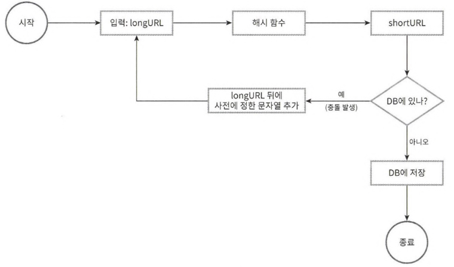
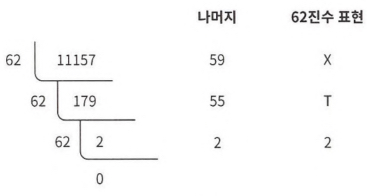

# URL 단축키

- 긴 웹사이트 주소(URL)를 짧게 변환해주는 서비스

## 사용방법

- 사용자가 긴 URL을 단축키 서비스에 입력
- 서비스는 고유한 식별자를 생성하고 기존의 짧은 도메인과 결합하여 단축 URL을 생성

## 장점

- 공유 용이성: 짧게 만들어 주므로 공유하기 쉬움
- 공간 절약: 문자 수가 제한된 경우 유용(메시지, 트윗)
- 클릭 추적: 클릭 수, 클릭 위치 등 분석 기능 제공
- 브랜드 도메인: 맞춤형 단축 도메인 사용 가능

## 단점

- 보안 문제: 악성 사이트로 리디렉션 될 위험
- 서비스 중단: 서비스 중단 시, 단축 URL도 사용 불가
- 영구성: 일정 기간만 사용 가능

# 문제

## 요구사항

- service(prefix): tinyurl
- length: shorter is better (avg length: 100)
- types of character: alphabetic, numeric
- updatability or deletability: none
- High Availability, High Scalability, High fault tolerance
- maximum number of records stored: 365B (→ * 100 = 36.5TB)
- traffic
  - read operation: 1,160 per sec (100m per day)
  - write operation : 11,600 per sec (100m per day)

# 해답

## API Endpoint (REST API)

- url shortening endpoint: 단축 url 생성
- url redirection endpoint: 단축 url 요청에 대해 원래 url로 리다이렉트

## URL Redirection

### server

- 301 or 302: short url → original url(location)

### redirection code

- 301: permanently moved
  - 
  - (브라우저에서) 응답 캐싱 O
  - 서버 부하 줄음
- 302: found
  - (브라우저에서) 응답 캐싱 X
  - 트래픽 분석 용이

## URL Shortening

- short url의 unique 값: original url → hash

### hash function

- 길이: 7
  - 숫자(10) + 영문자(52)로 365B개의 URL을 만들어 내야 함
  - $62^7 = 3.5T$
- 해시 충돌성 X
  - well known hash function(crc32, md5, sha-1)
    - 
    - 장점
      - 단축 url 길이 고정
      - 다음에 생성될 단축 url 예측 불가 (해시함수 특성)
      - ID 생성기 필요 X (해시값이 유일성을 가짐)
    - 단점
      - 충돌 가능성 O (→ 충돌 해소 전략 필요)
      - db 오버헤드 높음 (select query)(→ 블룸 필터 사용)
  - base-62
    -  
    - 장점
      - 수의 표현방식이 다른 두 시스템이 같은 수를 공유하여야 하는 경우 유용
      - 충돌 가능성 X
    - 단점
      - 단축 url 길이 가변적
      - 다음에 생성될 단축 url 예측 가능성 O (일정한 순서대로 증가)
      - ID 생성기 필요 O
- 복원 가능성 O

## Data Modeling

- RDB에 key-value 형식으로 저장: short url - original url
