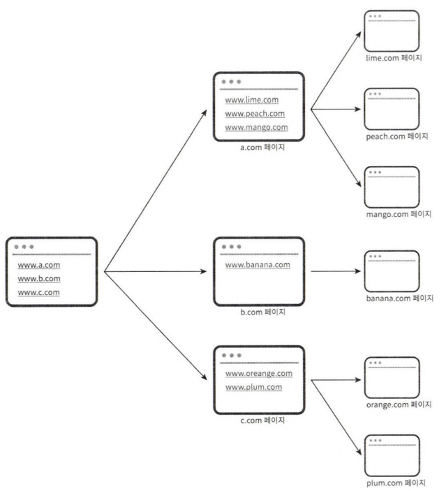
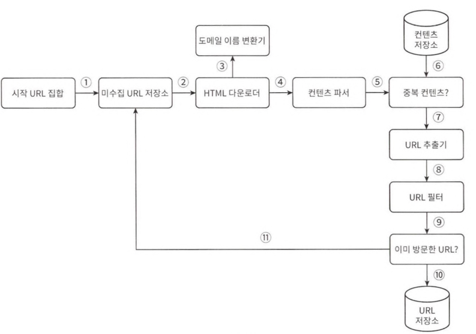
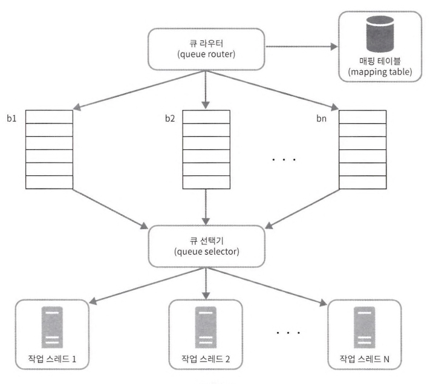
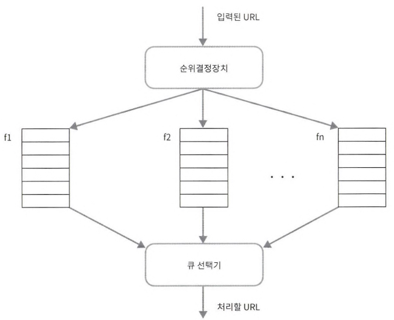

# 웹 크롤러

- 검색 엔진에서 널리 쓰이는 기술
- 인터넷 상의 웹 페이지를 자동으로 탐색하고 정보를 수집하는 프로그램

## 용도

- 검색 엔진 인덱싱: 웹페이지를 모아 검색 엔진을 위한 로컬 인덱스를 만듬
- 웹 아카이빙: 나중에 사용할 목적으로 장기보관하기 위해 웹에서 정보를 모으는 절차
- 웹 마이닝
- 웹 모니터링: 저작권 침해 사례 모니터링

## 알고리즘

1. 검색하고자 하는 URL 집합의 모든 웹 페이지를 다운로드
2. 다운받은 웹 페이지에서 URL들을 추출
3. 위 과정 반복

# 문제

## 요구사항

- 용도: 검색 엔진 인덱싱
- Page size: 500kb
- 수집량: 1B per month
  - QPS: 400
  - Peak QPS: QPS * 2 = 800
- 저장기한: 5y
  - 10억 * 500k = 500TB/Month
  - 500TB * 12 * 5 = 30PB
- 중복허용: X

---

- parallelism
- robustness: 웹 내의 비정상적인 문서에 대한 대응 (악성 링크, 문법오류 등)
- politness: 짧은 시간동안 너무 많은 요청을 보내서는 안됨
- extensibility: 새로운 형태의 콘텐츠의 크롤링도 지원하기 쉬워야 함 (문서 뿐만 아니라 이미지 등)

# 해답

## 수집 흐름

1. 시작 URL들을 미수집 URL 저장소에 저장
2. HTML 다운로더 
   도메인 이름 변환기: URL의 IP 주소 알아냄 
   웹 페이지 다운로드 (IP 주소 사용)
3. 콘텐츠 파서 
   파싱: HTML 페이지 형식 검증
4. 컨텐츠 저장소 
   중복 확인: 파싱한 페이지가 중복 컨텐츠인지 확인
5. URL 추출기 
   HTML 페이지 내의 링크를 골라냄 
   골라낸 링크를 URL 필터에 전달
6. URL 필터  
   중복 URL인지 확인
7. URL 저장소 
   이미 처리한 URL인지 확인 
   처리하지 않은 URL이면 저장소 저장 + 미수집 URL 저장소에 저장

### 미수집 URL 저장소

- 여러 요소를 고려하여 수집하는 크롤러

---

- 예의도: 짧은 시간동안 한 페이지에 최소한의 요청 (시간차를 두고 실행)
  -  
  - hostname-worker thread: 각 worker thread에 다운로드할 queue를 가지도록 설계
    - queue router: 같은 host에 속한 URL은 언제나 같은 큐에 가도록 보장
    - mapping table: hostname - queue
    - download queue
    - queue selector: queue에서 나온 URL을 worker thread에 전달하는 역할
    - worker thread: 전달된 URL을 순차적으로 다운로드하는 작업을 수행
- 우선순위(페이지 순위, 트래픽 양, 업데이트 빈도)
  -  
  - prioritizer: URL을 입력받아 우선순위를 계산
  - queue: 우선순위별로 queue가 하나씩 할당됨
  - queue selector: queue에서 처리할 URL을 꺼내는 역할 (순위가 높은 큐 우선)
- 신선도
  - 데이터의 신선함을 유지하기 위해서, 주기적으로 재수집할 필요가 있음
  - 웹페이지 변경 이력 활용
  - 우선순위가 높은 페이지는 좀 더 자주 재수집

### HTML 다운로더

- HTTP Protocol을 통해 웹 페이지를 다운받음
- Robots.txt
  - Robot Exclusion Protocol
  - 크롤러가 수집해도 되는 페이지 목록이 들어있음
- 성능 최적화
  - 분산 크롤링
  - 도메인 이름 변환 결과 캐시 
    - DNS Resolver를 통한 응답은 동기적으로 동작. 
    - 조회 결과를 캐싱하고, cron job을 돌려주어 최신화
  - 지역성: 서버를 지역별로 분산하는 방법
  - 짧은 타임아웃
  - 안정성: 안정 해시, 크롤링 데이터 지속적 저장장치에 기록, 예외처리, 데이터 검증
  - 확장성
  - 문제 있는 콘텐츠 감지 및 회피
    - 중복 콘텐츠, 거미 덫(크롤러를 무한 루프에 빠지도록 설계한 웹페이지), 데이터 노이즈(광고, 스팸)

## 알고리즘

- web: direct graph

### BFS 탐색

- 깊이를 가늠하기 어려우므로 bfs 탐색 사용
- URL간 우선순위를 두어 탐색
