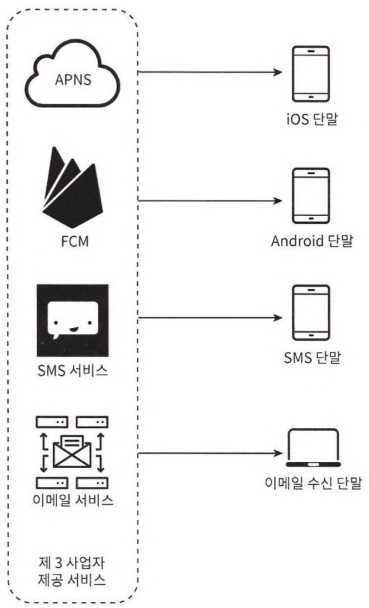
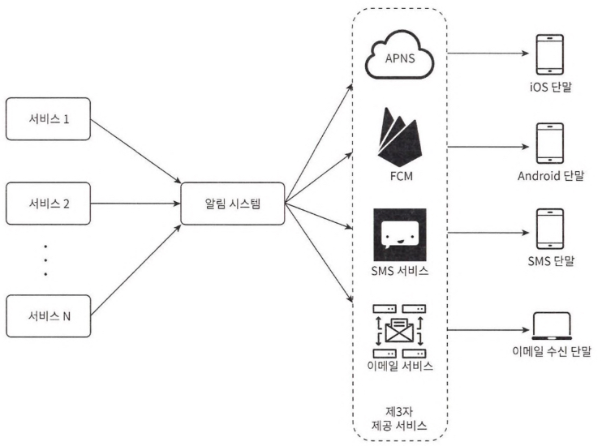
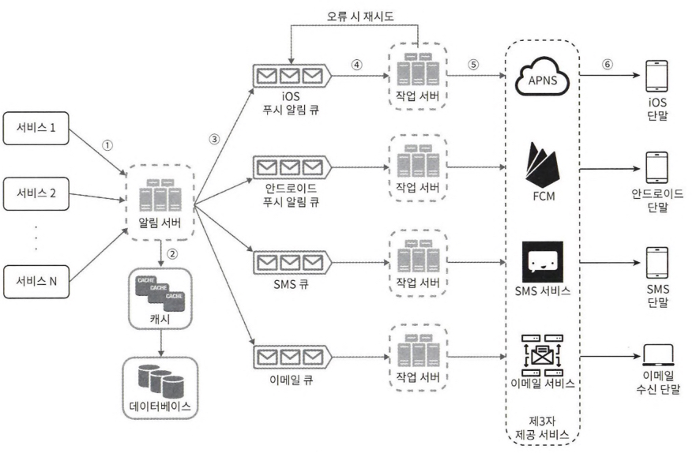
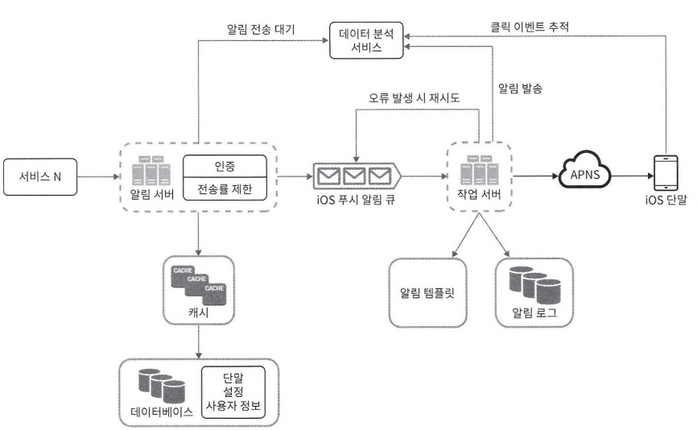
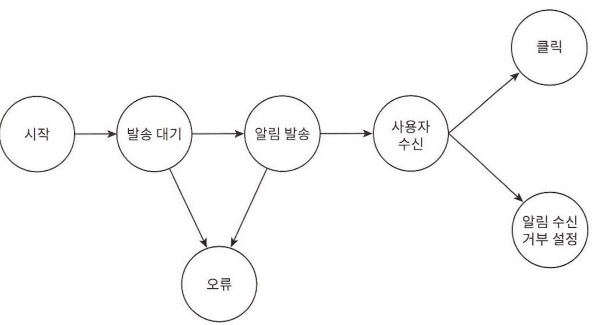

# Alarm System

- 쓰임: 최신 뉴스, 제품 업데이트, 이벤트, 선물
- 종류: 모바일 푸시 알림, SMS 메시지, 이메일
- 통신 방식: 비동기

## Push

### iOS

- provider: create notification request (to APNS)
    - device token: identification for creating notification request
    - payload: content (json)

### Android

- FCM(firebase Cloud Messaging)

### SMS Message

- SMS Service(Twilio, Nexmo)

### Email

- Email Service(Sendgrid, Mailchimp): high success rate, analytics

# Question

## Requirements

- Device: iOS, Android, Desktop
- number of alarms/d: mobile(10M), SMS(1M), email(5M)
- Real-Time
- High Extensibility
- Server: schedulable
- Client: setting alarm (opt-in, opt-out)

# Answer

## Draft

### component

- service: microservice(billing, delivery), cronjob
- notification server: API server, create payload
- third party service: extensibility, regionalization
- device: receive notification

### flaw

- notification server: SPOF, performance bottleneck(only one), low scalability

## Revision

### improvements

- scalability: separate main component, scale noti server
- loose coupling: use message queue
- efficiency(parallel): use message queue
- validation
- authentication
- caching

## Completion

- reliability
    - store alarm log(retry)
    - prevent duplicated noti: check event id
- efficiency
    - alarm template(reuseability)
    - rate limiting
- security
    - appKey & appSecret: request alarm service via api
- monitoring (analystic service)
    - message queue
    - event tracing

