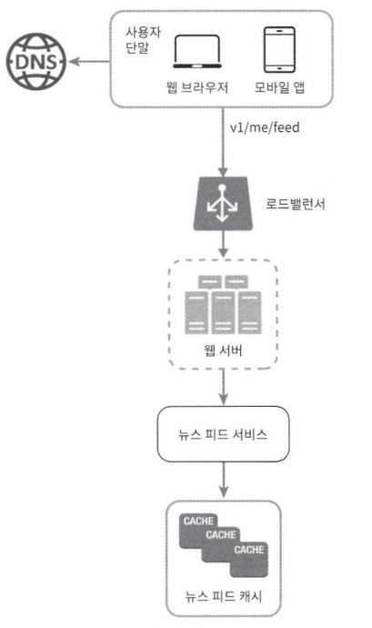
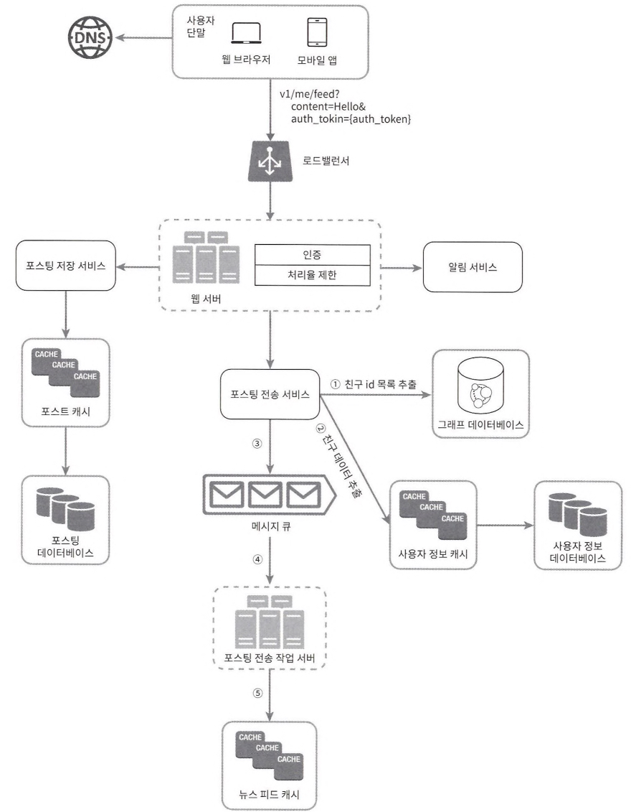

# 뉴스피드

- 지속적으로 업데이트되는 스토리
- 사용자 상태, 사진, 비디오, 링크, 활동, 좋아요(사람, 페이지, 그룹)

# Question

- Device: Mobile, Desktop
- Feature: story(create, list)
- Max Number of Friends: 5000
- DAU: 10M
- Feed(Story): Text, Image, Video

# Answer
## Draft
### Feed

- posting
  - post service: store feed data to db and cache
  - fanout service: send to friends’ news feed
  - notification service(push alarm)

### News Feed

- ordering: reverse chronological order
- posting
  - 
  - news feed service: retrieve news feed data
  - news feed cache

## Completion

### Web Server

- Authentication
- Rate limit

### Fanout Service
- request is distributed to multiple outputs
- model
  - fanout-on-write(push): post-time (immediate delivery)
    - 
    - pre-computed (already updated)
    - performance issue: fetching & updating (with many friends, especially for inactive users)
  - fanout-on-read(pull): read-time (on-demand)
    - 
    - better performance
    - longer to read the news feed

---
- database
  - nosql(graph): friends’ id list
  - rdbms: friends’ info (detail, mute)
- message queue: friends, new feed’s id
- working server: store news feed data to cache(feed id : user id)

### News Feed Service

1. Send a request to the load balancer.
2. distribute requests to one of the servers
3. call news feed service for retrieving feeds
4. retrieve the feed ID list from the news feed cache.
5. retrieve user and post information from the database.
6. respond with the news feed to the client.
7. render news feed

### Cache

- news feed: id
- contents: popular, normal
- social: follower, following
